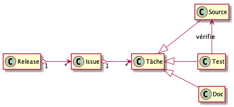

El valor de los proyectos de software desde el punto de vista de un desarrollador
============================================================

Usted es un desarrollador y, como cualquier desarrollador, le preocupa el valor de sus proyectos de software.

Sin embargo, cuando se inicia un proyecto de software, es posible que no se tenga una visión clara de los diferentes puntos que deben tenerse en cuenta.
Por supuesto, tienes que preocuparte por el código... pero también por las pruebas, los requisitos de usuario, las tareas, la documentación y los lanzamientos (releases).

Así que, ¿conoce algunas prácticas esenciales de ingeniería de software? Si es así, ¿las aplica? ¿Sabe cómo medir los beneficios que aportan? ¿Sabe cómo identificar las pérdidas a las que se arriesga por no seguirlas?

¿Por qué no te pruebas a ti mismo con [nuestro cuestionario](https://docs.google.com/forms/d/e/1FAIpQLSdvq-DgoZ8mJMLnCYOcagYdgb6h-LH-XZ3yidtTQfFGSEF1DQ/viewform)?

Aquí proporcionamos una lista mínima de puntos de control que se aplican a cualquier proyecto de software.
Consideramos [6 artefactos](#por-qué-6-artefactos) sobre los cuales la producción debe ser absolutamente controlada.
El enfoque que proponemos es muy minimalista y muy orientado al "Desarrollador" (por lo tanto, técnico).

**¡Permite a cualquier desarrollador entender mejor lo que está en juego en la producción de software!**

Nuestro enfoque no pretende responder a todos los problemas del Director de Proyecto (Project Manager). Hay métodos que se adaptan bien a esto.

El objetivo es poder medir la calidad técnica de un proyecto de software basado en estos 6 artefactos. De este modo, podrá saber si su proyecto es ideal (o casi), si está bien organizado (si las tareas y los requisitos de usuario tienen una calidad muy buena, pero el código, las pruebas, los documentos y las versiones no tanto), o si es más bien técnico (si el código y las pruebas tienen una buena calidad, pero no los requisitos, las tareas, los documentos y los lanzamientos no son tan buenos), etc.

Nuestro enfoque está pensado para ser abierto. Por lo tanto, se materializa en un proyecto GitHub para animar a todos a participar (no duden en enviar sus pull-request). El [método utilizado](./METHODE.md) para lograr nuestro objetivo también es abierto y claramente detallado, lo que nos permite medir la contribución de cada práctica.

Mejores prácticas
===============================

* [requisitos de usuario: la expresión de las necesidades que el software debe cubrir](./issue/)
* [tareas: el trabajo que hay que hacer para lograr completar los requisitos](./tache/)
* [pruebas: verificación del software](./test/)
* [código fuente: las instrucciones que la computadora ejecutará](./code/)
* [documentación: explicaciones sobre el software](./doc/)
* [lanzamiento : lo que será desplegado, ejecutado y por lo tanto utilizado](./release/)

¿Por qué 6 artefactos?
======================

Consideramos que cualquier producción de software requiere el desarrollo de al menos seis artefactos: Problema??, Tarea, Prueba, Código fuente, Documentación, Lanzamiento.

Cada uno de estos artefactos es fácilmente identificable por los archivos (aunque la documentación puede incluirse en un archivo de código fuente, es fácil distinguirla).

Cada artefacto tiene sus propias prácticas. Las prácticas imprescindibles que identificamos apuntan a un tipo de artefacto y realzan uno de sus aspectos.

Cada artefacto está relacionado con los demás. Por consiguiente, una práctica dirigida a un artefacto tiene un efecto en los otros artefactos relacionados.

Cada artefacto puede ser modificado, permitiendo que el software evolucione. Así pues, la práctica permite especificar cómo deben hacerse las modificaciones para mejorar el artefacto.

¿Qué método se utiliza para identificar una práctica indispensable?
===================================================================

Nuestra lista de prácticas indispensables es completamente abierta.

La [guía de redacción](./METHOD.md) de las prácticas describe el método que utilizamos. Este método también es abierto a modificaciones.

QUIZ: ¿Sigue las prácticas recomendadas?
==================================

Le proponemos un cuestionario que le permitirá medir el estado de sus prácticas. Así podrá saber qué artefactos puede mejorar sus hábitos.

¡Responde ahora [nuestro cuestionario] (https://docs.google.com/forms/d/e/1FAIpQLSdvq-DgoZ8mJMLnCYOcagYdgb6h-LH-XZ3yidtTQfFGSEF1DQ/viewform)!

¿Cuál es nuestro enfoque y cuál no lo es?
=========================================

Nuestro enfoque enumera las prácticas indispensables que se aplican a cualquier proyecto de software. Cada práctica enumerada se detalla claramente y su valor añadido se califica rigurosamente para poder medir su efecto.

Nuestro enfoque no es un método nuevo que explique los diferentes pasos a seguir para desarrollar software. No obstante, hace referencia a algunas prácticas propuestas por algunos métodos de mejora de la calidad.

Nuestro enfoque no es un nuevo estándar de producción de software. Nuestro objetivo no es en absoluto definir uno nuevo. El objetivo es hacer referencia a las prácticas habituales y especificar qué aspectos mejoran.
